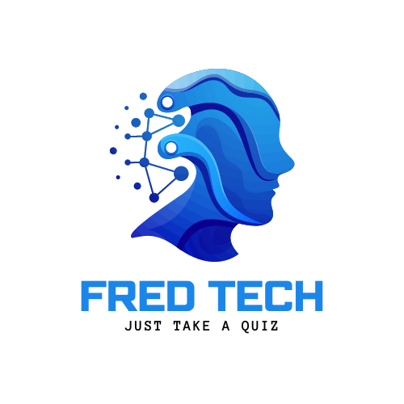
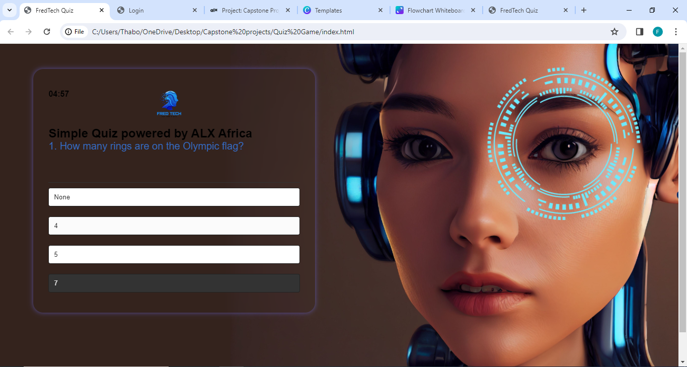
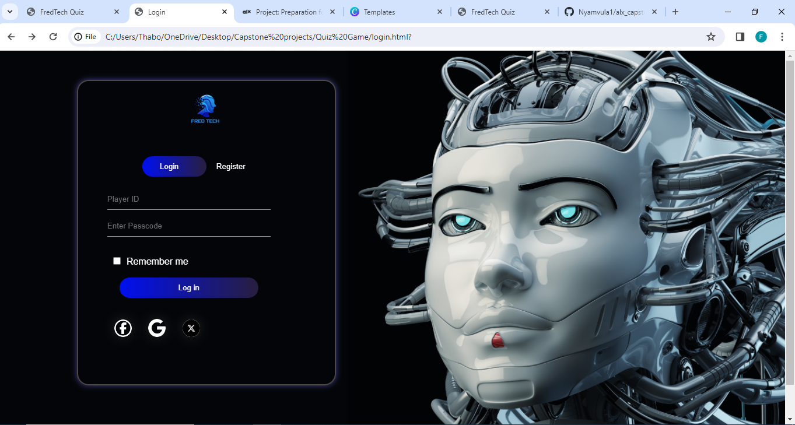

Project Overview:
This is a Quiz game that tests players on their understanding with regard to Tech issues. It is a simple test to play with friends in family gatherings, corporate testing and the main aim is to creat n awareness with regards to all things tech ad Artificial Intaligence (AI)
Features and Functionality:
Inside this app there are uniquely well thought questions that would make one think of their everyday use of machine learning and products they come across from day to day. The next button does not apear until the user has chosen an option. should the user choose a wrong question, the app will highlight the coreect one in green while the wrong one is highlighted in red, that is the user's choice.

This app from the designer point of view, can be used by schools, licencesing department and can be alter to the way that may suit the user and the institution that seeks to test the students. This is a great learning and testing tool and its styling is unique in a way that it attracts the user to do their outmost best.
Technologies Used:
Specify the technologies, frameworks, and languages used in the project. This can include HTML, CSS, JavaScript, Python, specific libraries, or frameworks like Flask, and any other tools or services utilized. We have used HTML( for the architecture of the web), CSS( for the styling of the app) and JavaScript (for the behaviour of the app). JavaScript has been a fadamental component as it has assisted us to structure the questions and formulate the behaviour of the app when the user selects an option.

I was hoping to add a login page, which is already designed, but technicalities could not allow me.
Screenshot Demo:

Roadmap and future enhancements:
I would like ti add login feachers and allow players of this who are assessed to be recornised by their unique credentials

Contact information:
Phone: +27 62 086 0616
email: sello.mathekga334@gmail.com